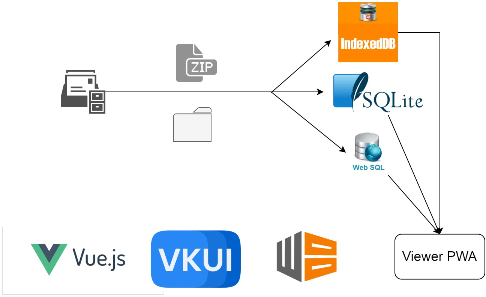

## Message Viewer / Searcher for data archive exported from VK.

  


Это веб-приложение позволяет просматривать архив сообщений из ВКонтакте (с интерфейсом мессенджера, а не мобильной версии, интерфейс которой используется по умолчанию), и осуществлять в поиск по сообщениям в архиве, по тексту сообщения и дате. Оно импортирует zip-папку или директорию с сообщениями в одну из выбранных локальных баз данных.  
При создании приложения были использованы библиотеки: [Vue](https://github.com/vuejs/vue), [Dexie.js](https://github.com/dfahlander/Dexie.js), [JSZip](https://github.com/Stuk/jszip), [SQL.js](https://github.com/sql-js/sql.js), [vue-virtual-scroll-list](https://github.com/tangbc/vue-virtual-scroll-list), [vue2-datepicker](https://github.com/mengxiong10/vue2-datepicker), а также [порт](https://github.com/Urapywka/vkui) библиотеки [VKUI](https://github.com/VKCOM/VKUI) для Vue.  
  
### Установка и запуск.
Собранное веб-приложение доступно [тут](https://remixer-dec.github.io/vk-export-msg-searcher). После первого запуска, его можно использовать оффлайн благодаря использованию Service Workers и библиотеки [Workbox](https://developers.google.com/web/tools/workbox/).  

Для запуска на локальной машине понадобятся [NodeJS](https://nodejs.org/en/) и npm.  
```
npm install  
npm run serve
```
для запуска сервера и 
```
npm run build
```
для сборки проекта.
  
Автор проекта [@remixer-dec](https://github.com/remixer-dec/). Отдельное спасибо [@vladislav805](https://github.com/vladislav805) за тестирование.  
Лицензия [CC-BY-NC-SA 4.0](https://creativecommons.org/licenses/by-nc-sa/4.0/deed.ru)